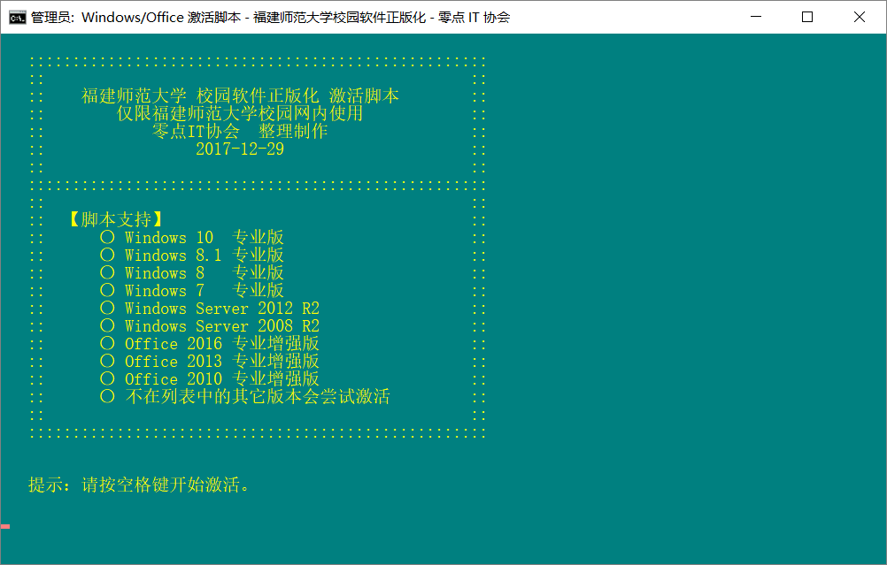
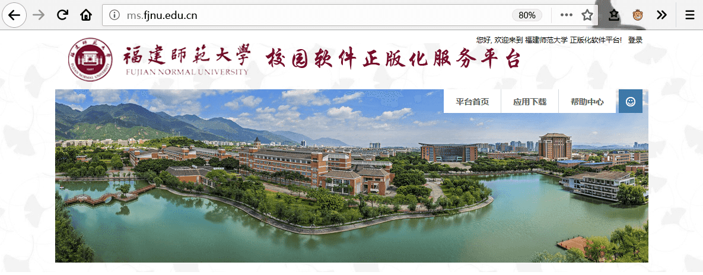
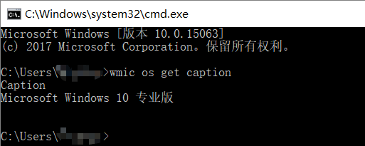

# 福建师范大学微软校园正版化

## 使用方法

[下载](https://github.com/fjnuer/fjnukms/archive/master.zip)、解压后，双击打开`福师大正版Windows、Office 激活脚本（双击打开，然后选是）.bat` 执行文件，弹出授权提示框，选“是”即可。如遇卡顿，请按空格键继续，稍等即可激活完成。




## 微软校园正版化

2017 年 12 月 29 日，福建师大信息办网站正式发文宣布了福建师范大学微软校园正版化，并启用了 [福建师范大学校园软件正版化服务平台](http://ms.fjnu.edu.cn/) （仅限内网访问，IP 为 10.128.8.1）。  



参见：
 - [关于启用微软正版化软件服务的通知](http://xxhb.fjnu.edu.cn/69/9e/c7620a158110/page.htm)
 - [我校正式启用微软正版化软件服务](http://xxhb.fjnu.edu.cn/69/e1/c7652a158177/page.htm)   
## 1 KMS 概述
Windows 和 Office 版本版本常见的有 Retail （零售）和 VOL（Volume Licensing for Organizations，团体批量许可证）版本。前者零售版本就是为每个授权提供一个唯一的专属的激活码（ CD-KEY），但这种方式显然不适用于大规模的组织（如大企业、高校），为了满足这些大规模组织的需求，批量授权由此诞生。批量授权的方案有两种，一种是 MAK（多次激活密钥），适用于小规模的组织；另一种方案就是 KMS，即 Key Management Service（密钥管理服务）的缩写，适用于大规模组织。  

### 1.1 KMS 原理
KMS 是 Client/Server （C/S）型的，系统管理员（System Administrator，SA）只需要设置一台激活服务器（Activation Server），使用 VOL 版本系统已安装的 KMS 客户端，通过使用一个批量激活密钥（VOL Key）就可以进行批量激活和管理，极大的减少了工作量。KMS 激活的过程简单说就是：欲激活的电脑向 KMS 服务器请求，KMS 服务器做出回应同意激活。  

### 1.2 KMS 合法性
KMS 激活是微软官方认可的一种系统激活方式，一般用于企业、高校或组织。微软授权的 KMS 才是正版，反之，用户使用一些第三方 KMS 激活工具激活后仍然不算是正版。  

2017 年 12 月 29 日，“福建师大信息办”公众号发文宣布了福建师范大学微软校园正版化，并启用了 [福建师范大学校园软件正版化服务平台](http://ms.fjnu.edu.cn/) （仅限内网访问，IP 为 10.128.8.1）。  

### 1.3 KMS 前提
KMS 激活的前提：当前系统是批量授权版本（VL 版），一般企业版都是 VL 版，专业版有零售和 VL 版。  
### 1.4 KMS 有效期
KMS 的有效期是 180 天，到期后应重新激活。事实上，如果你使用 KMS 激活后，每隔一段时间（如 7 天），KMS 客户端会尝试访问 KMS 服务器，如果成功收到服务器的响应，会自动续期，这样就无需 180 天手动激活。  

## 2 激活过程

### 2.1 获取 Windows 版本类型  
以下各个步骤需要在 cmd 下进行，按 Windows 键 + R 键，然后左下角弹出的框输入 cmd。  

如果你用 Windows 10，还可以直接右键开始图标（也可以 Windows 键 + X 键），选择“Windows PowerShell”或“**Windows PowerShell（管理员）**”，旧版本 Windows 10 则为“命令提示符”或者“**命令提示符（管理员）**”。  
打开蓝窗口（或黑窗口）后，输入如下命令，确认系统版本。
```
wmic os get caption
```
反馈结果如下，这里演示的版本是“Windows 10 专业版”


### 2.2 获取 KMS 客户端设置的密钥
前往微软官网的 [KMS Client Setup Keys](https://technet.microsoft.com/en-us/library/jj612867.aspx) 页面获取 KMS 客户端设置的 25 位产品密钥。其中带“N”的版本中不包含 Windows Media Player 播放器，另外家庭版无法用 KMS，因此这里并没有提供家庭版的密钥。

Windows 10 专业版：W269N-WFGWX-YVC9B-4J6C9-T83GX
Windows 10 企业版：NPPR9-FWDCX-D2C8J-H872K-2YT43
Windows 10 教育版：NW6C2-QMPVW-D7KKK-3GKT6-VCFB2
Windows 10 Enterprise 2015 LTSB：WNMTR-4C88C-JK8YV-HQ7T2-76DF9
Windows 10 Enterprise 2016 LTSB：DCPHK-NFMTC-H88MJ-PFHPY-QJ4BJ

Windows 10 专业版N：MH37W-N47XK-V7XM9-C7227-GCQG9
Windows 10 企业版N：DPH2V-TTNVB-4X9Q3-TJR4H-KHJW4
Windows 10 教育版N：2WH4N-8QGBV-H22JP-CT43Q-MDWWJ
Windows 10 Enterprise 2015 LTSB N：2F77B-TNFGY-69QQF-B8YKP-D69TJ
Windows 10 Enterprise 2016 LTSB N：QFFDN-GRT3P-VKWWX-X7T3R-8B639

例如，Windows 10 专业版（Windows 10 Professional） 对应的是 `W269N-WFGWX-YVC9B-4J6C9-T83GX`。

### 2.3 卸载密钥
如果使用过其他 key，可以先清除。新计算机或者重装系统后一般不需要执行这个步骤。
```
slmgr.vbs /upk
slmgr /upk
```
命令含义：清除密钥
命令反馈：弹出一个小窗口，“成功地卸载了产品密钥。”

### 2.4 设置密钥
刚才步骤 2.2 获取的 key 替换到下面：
```
slmgr /ipk W269N-WFGWX-YVC9B-4J6C9-T83GX
```
命令含义：设置对应的密钥
命令反馈：弹出一个小窗口，“成功地安装了产品密钥 XXXXX-XXXXX-XXXXX-XXXXX-XXXXX。”

### 2.5 设置 KMS 服务器
KMS 服务器是一个域名或者 IP 地址，只有微软授权的 KMS 服务器才是正版。**警告：使用盗版的 KMS 服务器有风险。**
例如，福建师范大学的 KMS 服务器地址为 10.128.8.2，此处的 10.128.8.2 是内网地址，仅供福建师范大学校园网内的用户使用，且需有线接入，无线接入无效。校外、其他非师大校园网用户使用无效。
```
slmgr /skms 10.128.8.2
```
命令含义：设置服务器地址（set kms）为 10.128.8.2
命令反馈：弹出一个小窗口，“密钥管理服务计算机名成功的设置为 10.128.8.2。”
### 2.6 激活
```
slmgr /ato
```
命令含义：理解对当前设置的 key 和服务器地址等进行尝试激活操作。
命令反馈：弹出一个小窗口，“正在激活 Windows(R) XXX (xxxxxx) 成功地激活了产品。”

**附**：查看剩余分钟数（**KMS 需要每 180 天激活一次**）
```
slmgr /dlv
```
提示“批量激活过期：xxx 分钟(xx天)”。